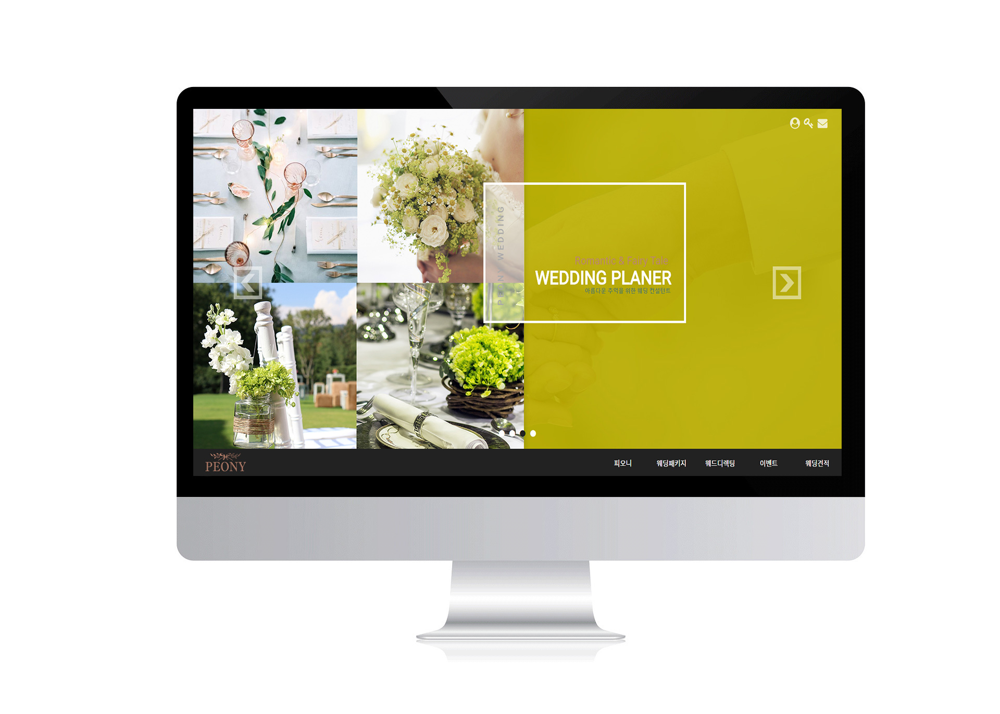
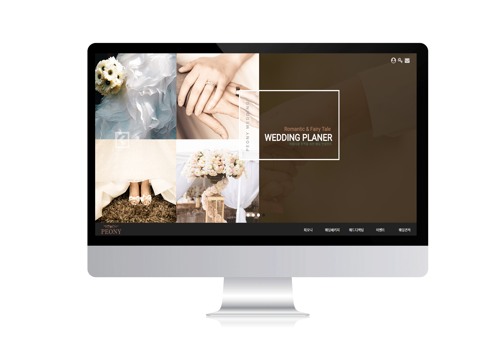
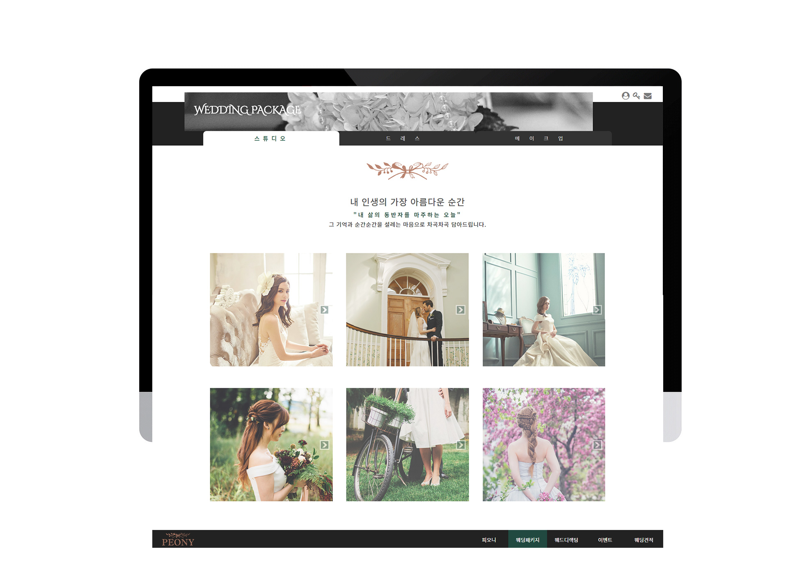
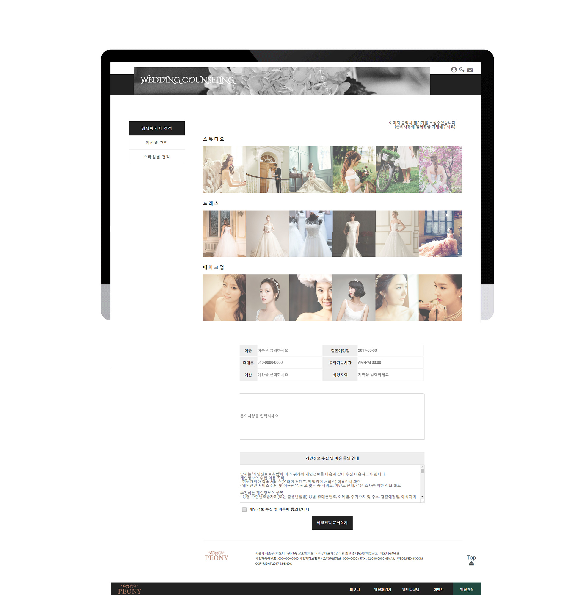

# project_peony

<h3>
심플한 디자인, 컬러를 주 컨셉으로 주로 따뜻한 느낌의 이미지, 내츄럴한 느낌의 소품, 꽃이나 조명, 장식 등을 사용하여 사용자의 접근성을 높이는 사이트입니다. 
대표적인 기능은 웨딩의 컬러 스타일을 정해 사용자의 색다른 경험을 추구할수 있게 도우며 다양한 이미지를 통해 선택의 폭을 넓히는 것이 목적입니다. 
</h3>

<h2>컬러 컨셉을 강조한 이동 배너 </h2>

<h2>주제에 맞는 분류</h2>

<h2>견적문의</h2>
